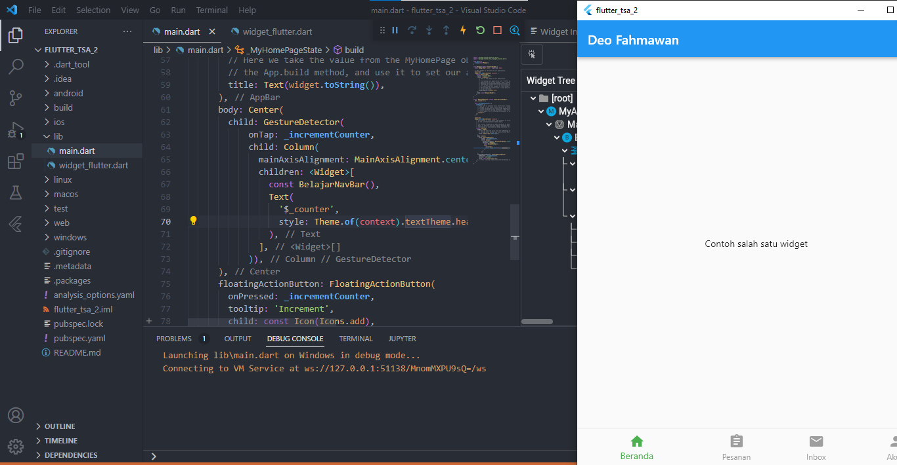
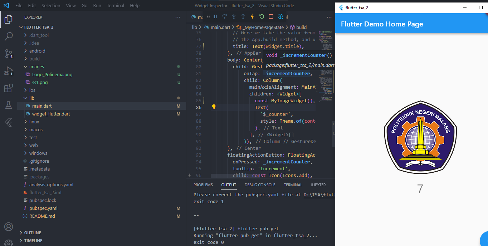
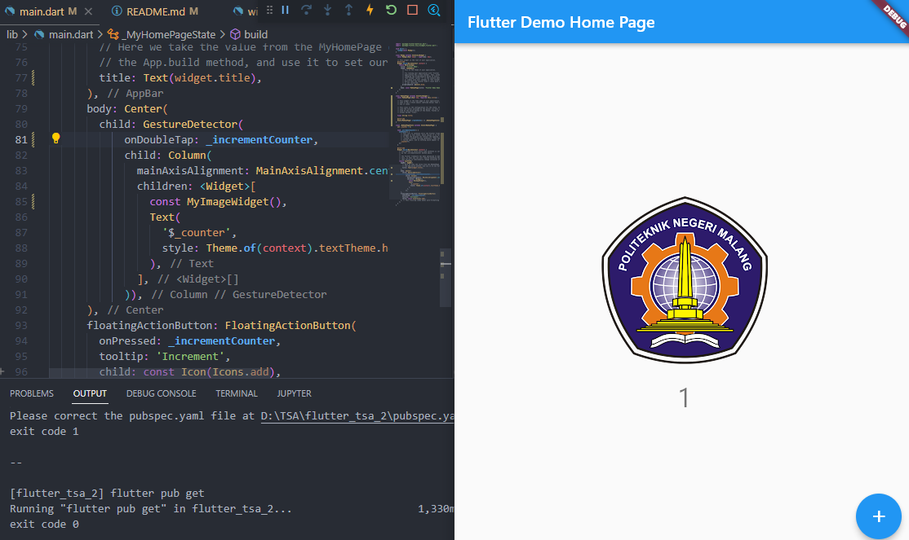
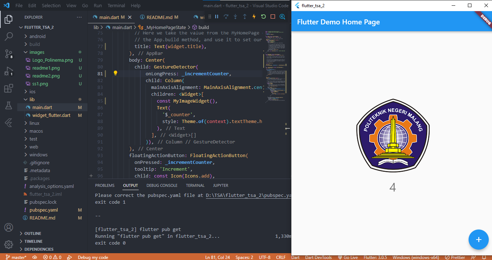
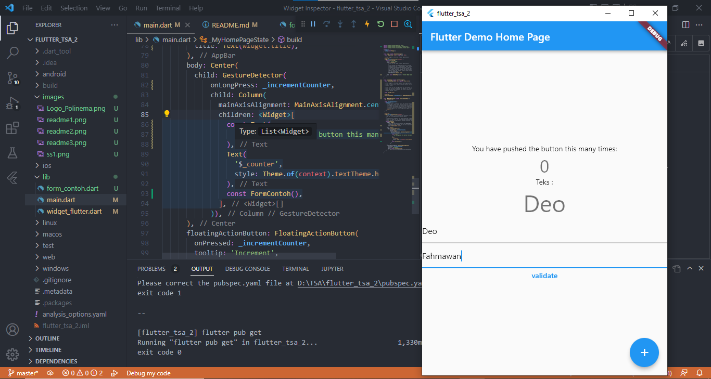
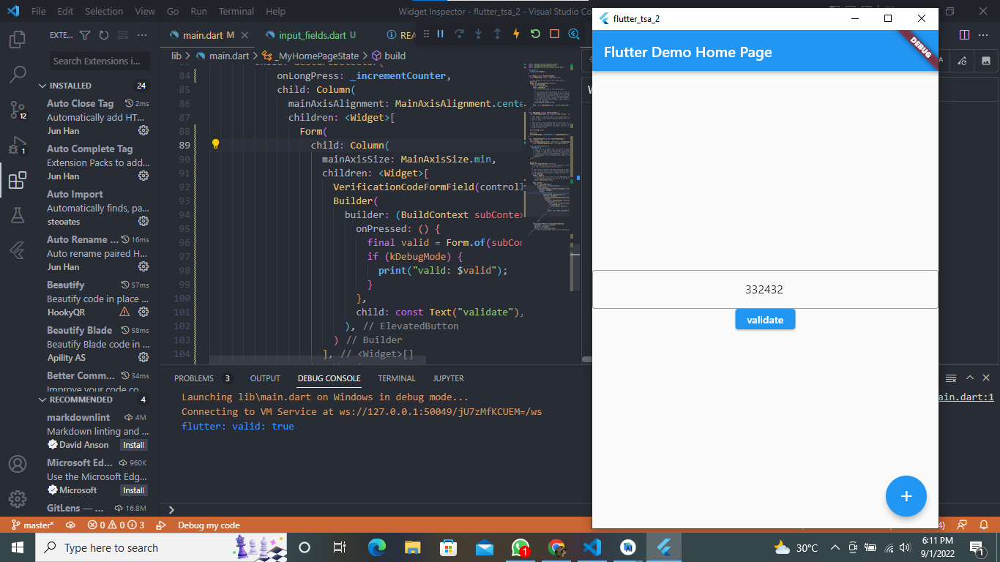

# flutter fundamental part 3
Pada kelas hari ini kita menambahkan beberapa modifikasi pada main flutter, pada saat ini kita akan menambahkan beberapa perubahan salah satunya yaitu dengan menambahkan sebuha gesture Detecctor yang diterapkan pada main kita

# Menambahkan GestureDetector
Di sini kita akan melakukan modifikasi pada main.dart kita untuk menambahkan code untuk menjalankan sebuah gesture detector nya

# Tugas Prak 1

Disini saya akan menjelaskan bagaimana caranya gambar tersebut bisa di beri tindakan dan dapat melakukan perhitungan jika di pencet, bisa kita lihat menggunakan widget gesture detector yang dimana widget ini memberikan gesture klick ke semua layar, ada beberapa yang bisa dilakukan widget ini tetapi kita disini menggunakan click, dan MyImageWidget tersebut dibungkus oleh widget detector dan diberikan fungsi increment sehingga pada saat diberikan tindakan maka akan menjalankan widget tersebut

# Gesture OnDoubleTap

Disini kita akan mencoba fungsi lain dari gesture detector yaitu menggunakan sebuah double tap, jika ontap kita ganti dengan menggunakan fungsi ini maka kita harus melakukan tindakan click 2 kali pada gambar tersebut baru akan menjalankan fungsi increment

# Gesture onLongPress

nah disini kita akan mencoba lagi fungsi lain yang bisa dilakukan oleh gesture detector, yaitu on press dari namanya bearti kita harus melakukan tindakan click lama baru fungsi selanjutnya akan dijalankan, sehingga jika kita menggunakan fungsi ini maka kita harus melakukan click lama pada gambar sehingga akan terjadi increment

# Praktikum 2: Menerapkan Input Widget dan Forms

Disini kita akan mencoba menerapkan input dan form dengan sederhana pada contoh diatas kita telah bisa menerapkan input widget dan form dengan sederhana

# Praktikum 3: Menerapkan Custom Input dan FormField Widget

Disini kita akan menerapkan custom input dan formfield dengan mengikuti langkah langkah yang sudah di berikan, disini kita disuruh untuk menulis string dan int, tetapi tidak bisa karena dalam code telah diberikan batasan untuk hanya bisa mngetikan 0-9 dan hanya 6 angka 